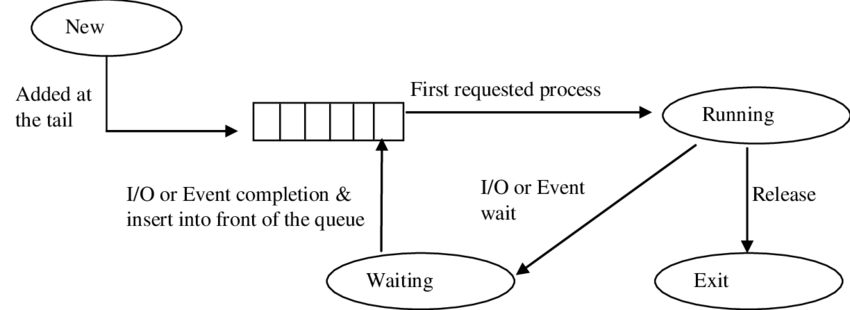

# CPU Scheduler
**Author** : Siddhant Rohila
## Project Description

Operating systems are integral to the efficient management of computer resources, with process scheduling being a core component. This project, the CPU Scheduler application, aims to simulate and evaluate various process scheduling algorithms through a user-friendly interface developed using Electron and a set of robust backend algorithms implemented in C++.

- **Scheduling Algorithms**:
  - First Come First Serve (FCFS)
  - Longest Job First (LJF)
  - Shortest Job First (SJF)
  - Highest Response Ratio Next (HRRN)
  - Longest Remaining Time First (LRTF)

- **Features**:
  - Provides insights into the strengths and weaknesses of different scheduling algorithms
  - Allows users to input various processes and observe how each scheduling algorithm manages them
  - Facilitates visualization and comparison of algorithm performance
  - Enhances understanding of how different algorithms impact system efficiency and responsiveness

- **Technology Stack**:
  - **Frontend**: User-friendly interface developed using Electron
  - **Backend**: Robust algorithms implemented in C++

- **Educational Tool**:
  - Serves as a practical resource for examining multiple scheduling strategies
  - Aids in comprehending the intricacies of process scheduling in operating systems

The combination of an intuitive Electron-based interface and a high-performance C++ backend makes the CPU Scheduler both accessible and powerful. It is an invaluable resource for anyone looking to delve into the complexities of process scheduling within operating systems.


## Installation of the Project
- Git clone this repository
- Compile the file "scheduler.cpp" with a C++ compiler.
- Run npm install in the terminal
- Further run npm start, the CPU Scheduler application will start.

## How to use the application ? 
- The first look of the application will be like this :
  <div style="display: flex; flex-direction: column; align-items: center;">
    
    <p style="text-align: center;"><em>Figure 1: Application's initial look</em></p>
  </div>

- It consists of a selection bar where we can select one of the 5 CPU Scheduling algorithms I've implemented. You can write the process details in a format I'll explain later.
  <div style="display: flex; flex-direction: column; align-items: center;">
    
    <p style="text-align: center;"><em>Figure 2: The Algorithm Selection</em></p>
  </div>
- Any 2 processes are separated by a semicolon ';' . The 4 numbers separated by a comma ',' are  identity, Arrival Time, Burst Time and priority for the corresponding       process respectively. Consider an example where I select the FCFS algorithm, I've written the process details as shown :
  <div style="display: flex; flex-direction: column; align-items: center;">
    
    <p style="text-align: center;"><em>Figure 3: FCFS Example consisting of 4 processes</em></p>
  </div>
- After we press the "Go!" button, the output is as shown
    <div style="display: flex; flex-direction: column; align-items: center;">
    
    <p style="text-align: center;"><em>Figure 4(a): Output</em></p>
  </div>
- The Gantt Chart display on output
  <div style="display: flex; flex-direction: column; align-items: center;">
    
    <p style="text-align: center;"><em>Figure 4(b): Output Gantt Chart</em></p>
  </div>


Let us breakdown the output of the program :
- **Completion Time** : Completion time is when a process finishes execution and is no longer being processed by the CPU. It is the summation of the arrival, waiting, and burst times. Completion time is an essential metric in CPU scheduling, as it can help determine the efficiency of the scheduling algorithm.
- **Waiting Time** : Waiting time (WT) is defined as the total time that is spent by the process while staying in a ready queue before it reaches the CPU. The difference between turnaround time and burst time is called the waiting time of a process.
- **Turnaround Time** : Turnaround time is the total time taken to execute a process from the moment it enters the CPU until it completes execution, including both CPU processing time and any time spent waiting in the ready queue or waiting for I/O operations.
- **The Average Values**
    - **Average Turnaround Time** : To find the average turnaround time for a set of processes, you sum the turnaround times of all individual processes and then divide by the number of processes.
    - **Average Waiting Time** : In CPU scheduling, the average waiting time is a key performance metric. It measures the average time a process spends waiting in the ready queue before it gets executed by the CPU. The waiting time for a process can be influenced by the scheduling algorithm used.
    - **Scheduling Overhead** : Scheduling overhead refers to the additional time and resources required to manage the execution of processes by the CPU scheduler. This overhead can impact the overall performance and efficiency of the CPU scheduling.
- **The Gantt Chart** : A Gantt chart is a visual representation of the schedule of processes or tasks over time. It provides a graphical illustration of when each process starts and finishes, allowing for easy visualization of the overall CPU scheduling process.
    - Gantt charts provide a clear and intuitive way to visualize the scheduling of processes. It allows system administrators, developers, or analysts to quickly understand the sequence of process execution.
    -  By displaying when processes are running or waiting, Gantt charts help in managing CPU resources efficiently. This is particularly useful in systems where multiple processes compete for CPU time.
    -   Gantt charts enable analysts to evaluate the effectiveness of different scheduling algorithms. By comparing the actual execution sequence against theoretical models, they can assess factors like waiting times, turnaround times, and overall system responsiveness.
    -    During runtime, Gantt charts can be updated dynamically to reflect the progress of processes. This allows for real-time monitoring of the system's workload and performance.

What happens if we throw an invalid format in the format details ? It will throw an error!
  <div style="display: flex; flex-direction: column; align-items: center;">
    
    <p style="text-align: center;"><em>Figure 5: Error due to invalid format</em></p>
  </div>

## Working and theory
### Algorithms
  <div style="display: flex; flex-direction: column; align-items: center;">
    
    <p style="text-align: center;"><em>Figure 6: CPU Scheduling Algorithms</em></p>
  </div>
  
- **First Come First Serve (FCFS)**

```
void FCFS(std::vector<Process>& processes) {
    int n = processes.size();
    int currentTime = 0;
    auto cmp = [&](Process P1, Process P2) -> bool {
        return P1.arrivalTime < P2.arrivalTime;
    };
    std::sort(processes.begin(), processes.end(), cmp);
    for (int i = 0; i < n; ++i) {
        if (currentTime < processes[i].arrivalTime) {
            currentTime = processes[i].arrivalTime;
        }
        processes[i].completionTime = currentTime + processes[i].burstTime;
        processes[i].turnAroundTime = processes[i].completionTime - processes[i].arrivalTime;
        processes[i].waitingTime = processes[i].turnAroundTime - processes[i].burstTime;
        currentTime += processes[i].burstTime;
    }
}

```

- The FCFS scheduling algorithm is a straightforward CPU scheduling technique that executes processes in the order they arrive. It is non-preemptive, meaning once a process starts execution, it runs to completion without interruption. This approach ensures simplicity but can lead to the "convoy effect," where short processes wait for long ones.
- The given implementation sorts processes by arrival time to handle them in the correct order. The std::sort function is used with a custom comparator to achieve this. The currentTime variable keeps track of the ongoing simulation time. As each process is handled, if the currentTime is less than the arrival time of the current process, currentTime is updated to the process's arrival time, ensuring no unnecessary waiting.
- For each process, its completion time is calculated by adding its burst time to the current time. The turnaround time, which is the difference between completion time and arrival time, and the waiting time, which is the difference between turnaround time and burst time, are then computed. After updating these metrics, currentTime is incremented by the burst time of the current process, reflecting the time taken to complete the process's execution.
- In summary, this FCFS implementation sorts processes by arrival time and sequentially updates the current time, completion time, turnaround time, and waiting time for each process, ensuring a straightforward execution sequence.
  
  <div style="display: flex; flex-direction: column; align-items: center;">
    
    <p style="text-align: center;"><em>Figure 7: An example flowchart for a scheduling algorithm (FCFS)</em></p>
  </div>

- **Shortest Job First (SJF)**
  ```
  void SJF(std::vector<Process>& processes) {
    std::sort(processes.begin(), processes.end(), [](const Process& a, const Process& b) {
        return a.arrivalTime < b.arrivalTime;
    });
    int currentTime = 0;
    std::vector<bool> vis(processes.size(), false);
    processes[0].startTime = processes[0].arrivalTime;
    int cnt = 0;
    size_t i = 0;

    while (cnt < processes.size()) {
        if (vis[i]) {
            i++;
            continue;
        }
        if (currentTime < processes[i].arrivalTime) {
            currentTime = processes[i].arrivalTime;
        }
        int idx = -1;
        int mn = 1e9;
        for (size_t j = 0; j < processes.size(); j++) {
            if (vis[j]) continue;
            if (processes[j].arrivalTime <= currentTime) {
                if (processes[j].burstTime < mn) {
                    idx = j;
                    mn = processes[j].burstTime;
                }
            }
        }
        if (idx == -1) {
            currentTime++;
            continue;
        }
        processes[idx].startTime = currentTime;
        processes[idx].completionTime = currentTime + processes[idx].burstTime;
        processes[idx].turnAroundTime = processes[idx].completionTime - processes[idx].arrivalTime;
        processes[idx].waitingTime = processes[idx].turnAroundTime - processes[idx].burstTime;
        currentTime = processes[idx].completionTime;
        vis[idx] = true;
        cnt++;
        i = idx;
    }
  }
  ```
  - The SJF (Shortest Job First) scheduling algorithm is another CPU scheduling technique that selects the process with the smallest burst time from the set of processes that are ready to execute. This algorithm aims to minimize the average waiting time by prioritizing shorter processes. SJF can be either preemptive or non-preemptive; in this case, we are considering the non-preemptive version where the shortest job is selected only when the CPU is free.
  - The algorithm begins by sorting the processes based on their arrival times. This ensures that we always consider the processes in the order they arrive. We then initialize currentTime to keep track of the ongoing simulation time, and vis (a vector of booleans) to keep track of whether each process has been executed.
  - A while loop runs until all processes are completed. Inside the loop, if the current time is less than the arrival time of the current process, currentTime is updated to the arrival time of the next process. The algorithm then searches for the process with the smallest burst time among those that have arrived but not yet been executed. If no such process is found (i.e., all arrived processes have been executed), currentTime is incremented.
  - Once the process with the shortest burst time is found, its start time, completion time, turnaround time, and waiting time are calculated. currentTime is updated to reflect the time after the process has finished execution, and the process is marked as visited. This continues until all processes have been executed.

- **Longest Job First (LJF)**

```
void LJF(std::vector<Process>& processes) {
    int n = processes.size();
    int currentTime = 0;
    int completed = 0;
    std::vector<bool> completedProcess(n, false);

    while (completed != n) {
        int currentProcess = -1;
        int longestBurstTime = -1;

        for (int i = 0; i < n; ++i) {
            if (processes[i].arrivalTime <= currentTime && !completedProcess[i]) {
                if (processes[i].burstTime > longestBurstTime) {
                    longestBurstTime = processes[i].burstTime;
                    currentProcess = i;
                }
                if (processes[i].burstTime == longestBurstTime && processes[i].arrivalTime < processes[currentProcess].arrivalTime) {
                    currentProcess = i;
                }
            }
        }
        if (currentProcess == -1) {
            currentTime++;
            continue;
        }
        processes[currentProcess].startTime = currentTime;
        currentTime += processes[currentProcess].burstTime;
        processes[currentProcess].completionTime = currentTime;
        processes[currentProcess].turnAroundTime = processes[currentProcess].completionTime - processes[currentProcess].arrivalTime;
        processes[currentProcess].waitingTime = processes[currentProcess].turnAroundTime - processes[currentProcess].burstTime;

        completedProcess[currentProcess] = true;
        completed++;
    }
}
```
- The LJF scheduling algorithm is a CPU scheduling technique that prioritizes processes with the longest burst time among the processes that have arrived and are ready to execute. It is a non-preemptive scheduling algorithm, meaning once a process starts executing, it runs to completion without interruption. This approach can lead to high waiting times for shorter processes but ensures that longer processes are given priority.
- The algorithm iterates through the list of processes, checking each one to see if it has arrived and is not yet completed. Among the arrived and incomplete processes, the one with the longest burst time is selected for execution. If there are multiple processes with the same longest burst time, the one that arrived first is chosen. This selection process ensures that the longest job is always given priority.
- The currentTime variable keeps track of the ongoing simulation time, and completed counts the number of processes that have been fully executed. A vector completedProcess keeps track of which processes have been completed.
- This LJF implementation iterates through the list of processes, identifying the process with the longest burst time among those that have arrived and are not yet completed. For each selected process, it updates the start time, completion time, turnaround time, and waiting time. The algorithm continues until all processes are executed, ensuring that the CPU always works on the longest available job. This approach may lead to higher waiting times for shorter processes but ensures that longer processes are given priority, which can be beneficial in specific scenarios where longer processes are critical.
  
- **Longest Remaining Time First (LRTF)**
```
void LRTF(std::vector<Process>& processes) {
    int n = processes.size();
    std::vector<int> remainingTime(n);
    std::vector<int> lastExecutionTime(n, 0);
    for (int i = 0; i < n; ++i) {
        remainingTime[i] = processes[i].burstTime;
    }
    int currentTime = 0;
    int completed = 0;
    while (completed != n) {
        int maxRemainingTime = -1;
        int currentProcess = -1;
        for (int i = 0; i < n; ++i) {
            if (processes[i].arrivalTime <= currentTime && remainingTime[i] > 0) {
                if (remainingTime[i] > maxRemainingTime) {
                    maxRemainingTime = remainingTime[i];
                    currentProcess = i;
                }
            }
        }
        if (currentProcess == -1) {
            currentTime++;
            continue;
        }
        if (lastExecutionTime[currentProcess] == 0) {
            processes[currentProcess].startTime = currentTime;
        }
        remainingTime[currentProcess]--;
        currentTime++;

        if (remainingTime[currentProcess] == 0) {
            completed++;
            processes[currentProcess].completionTime = currentTime;
            processes[currentProcess].turnAroundTime = currentTime - processes[currentProcess].arrivalTime;
            processes[currentProcess].waitingTime = processes[currentProcess].turnAroundTime - processes[currentProcess].burstTime;
        }
    }
}
```
- The LRTF scheduling algorithm is a preemptive version of the LJF (Longest Job First) algorithm. It selects the process with the longest remaining burst time for execution. If a new process arrives with a longer remaining burst time than the currently executing process, the currently executing process is preempted, and the new process is given the CPU.
- The algorithm maintains the remaining burst time for each process and iterates through the processes to find the one with the maximum remaining burst time that has arrived and is ready to execute. If no such process is found, the current time is incremented. If a process with the longest remaining time is found, it is executed for one time unit. If this process finishes execution (remaining time becomes zero), its completion time, turnaround time, and waiting time are calculated. The algorithm continues until all processes are completed.
- Hence, this LRTF implementation iterates through the processes, identifying the one with the longest remaining burst time that has arrived and is not yet completed. For each selected process, it executes for one time unit. If no process is ready to execute, the current time is incremented. When a process completes execution, its completion time, turnaround time, and waiting time are calculated. The algorithm continues until all processes are executed, ensuring that the CPU always works on the job with the longest remaining burst time, allowing for preemption if a new longer job arrives. This approach ensures that longer processes get more CPU time, but it may increase waiting times for shorter processes.

- **Highest Response Ratio Next (HRRN)**
```
void HRRN(std::vector<Process>& processes) {
    int n = processes.size();
    int currentTime = 0;
    int completedCount = 0;
    std::sort(processes.begin(), processes.end(), [](const Process& a, const Process& b) {
        return a.arrivalTime < b.arrivalTime;
    });
    while (completedCount < n) {
        double maxResponseRatio = -1;
        int currentProcess = -1;
        for (int i = 0; i < n; ++i) {
            if (processes[i].arrivalTime <= currentTime && processes[i].completionTime == 0) {
                int waitingTime = currentTime - processes[i].arrivalTime;
                double responseRatio = (waitingTime + processes[i].burstTime) / (double)processes[i].burstTime;

                if (responseRatio > maxResponseRatio) {
                    maxResponseRatio = responseRatio;
                    currentProcess = i;
                }
            }
        }
        if (currentProcess == -1) {
            currentTime++;
            continue;
        }
        processes[currentProcess].startTime = currentTime;
        currentTime += processes[currentProcess].burstTime;
        processes[currentProcess].completionTime = currentTime;
        processes[currentProcess].turnAroundTime = processes[currentProcess].completionTime - processes[currentProcess].arrivalTime;
        processes[currentProcess].waitingTime = processes[currentProcess].turnAroundTime - processes[currentProcess].burstTime;
        completedCount++;
    }
}
```
- The HRRN scheduling algorithm is a non-preemptive CPU scheduling technique that selects the next process to execute based on the highest response ratio. The response ratio is calculated as follows :
```math
\text{Response Time} = \frac{\text{Waiting Time} + \text{Burst Time}}{\text{Burst Time}}
```
This ratio ensures that processes with longer waiting times are given higher priority, thus balancing the needs of short and long processes.

- The algorithm begins by sorting the processes based on their arrival times. It then iterates through the list of processes, calculating the response ratio for each process that has arrived and is not yet completed. The process with the highest response ratio is selected for execution. If no process is ready to execute, the current time is incremented. Once a process is selected, its start time, completion time, turnaround time, and waiting time are calculated. The algorithm continues until all processes are completed.
- Hence, this HRRN implementation starts by sorting the processes by arrival time. It then calculates the response ratio for each process that has arrived and is not yet completed, selecting the process with the highest ratio for execution. The selected process's start time, completion time, turnaround time, and waiting time are updated, and the algorithm continues until all processes are completed. This approach ensures that processes with longer waiting times are given higher priority, providing a balanced scheduling strategy that benefits both short and long processes.

### Some JavaScripts Explanations :
1. **script_ipc.js**
```
const { ipcRenderer } = require('electron');

const runSchedulerBtn = document.getElementById('runSchedulerBtn');
const resultElement = document.getElementById('result');
const averageBox = document.getElementById('averageBox');
const averageTATElement = document.getElementById('averageTAT');
const averageWTElement = document.getElementById('averageWT');
const cpuOverheadElement = document.getElementById('cpuOverhead'); 

runSchedulerBtn.addEventListener('click', () => {
    const algorithm = document.getElementById('algorithmSelect').value;
    const input = document.getElementById('processInput').value;

    console.log('Sending runScheduler event with algorithm:', algorithm);
    console.log('Input:', input);

    ipcRenderer.send('runScheduler', { algorithm, input });
});

ipcRenderer.on('schedulerResult', (event, { error, result }) => {
    if (error) {
        console.log(`Scheduler error: ${error}`);
        resultElement.innerText = `Error: ${error}`;
        resultElement.classList.add('text-danger');
        resultElement.classList.remove('text-success');
    } else {
        console.log('Scheduler result:', result);
        const { processes, averageTAT, averageWT, schedulingOverhead } = result;
        resultElement.innerText = `Processes: ${JSON.stringify(processes, null, 2)}`;
        
        averageTATElement.innerText = `Average Turnaround Time: ${averageTAT}`;
        averageWTElement.innerText = `Average Waiting Time: ${averageWT}`;
        cpuOverheadElement.innerText = `Scheduling Overhead: ${schedulingOverhead.toFixed(12)} s`;

        averageBox.style.display = 'block';
        renderGanttChart(processes);
        resultElement.classList.add('text-success');
        resultElement.classList.remove('text-danger');
    }
});
```
- This JavaScript code, designed to be used within an Electron-based CPU scheduling project, facilitates the interaction between the user interface and the backend logic for running different scheduling algorithms. It uses Electron's IPC (Inter-Process Communication) capabilities to send and receive messages between the renderer process (the front-end) and the main process (the back-end). This separation of concerns helps maintain a clean architecture where the front-end handles user interactions and displays results, while the back-end performs the computational tasks.
- The code begins by importing the ipcRenderer module from Electron, which allows the renderer process to communicate with the main process. It then selects various HTML elements from the document, such as buttons and divs, which will be used to display results and capture user inputs. The runSchedulerBtn element is particularly important as it triggers the scheduling process when clicked. This button is linked to an event listener that captures the selected scheduling algorithm and the process data inputted by the user. These details are then sent to the main process via the ipcRenderer.send method, effectively requesting the scheduling computation.
- Upon receiving the results from the main process through the ipcRenderer.on event listener, the code handles both success and error scenarios. If an error occurs during the scheduling computation, the error message is displayed to the user with appropriate styling to indicate a problem. Conversely, if the scheduling is successful, the resulting process details, average turnaround time (TAT), average waiting time (WT), and scheduling overhead are displayed. The scheduling overhead is formatted to a precise float value, indicating the time taken by the scheduler in seconds, and is shown in the cpuOverheadElement.
- In addition to displaying textual results, the code also includes functionality for rendering a Gantt chart to visually represent the scheduling of processes. This visualization is achieved through a separate function, renderGanttChart, which utilizes D3.js to create an SVG-based chart. The function sets up the necessary scales and axes, and maps the process data to draw colored bars representing each process's execution period. This visual aid helps users better understand the scheduling order and duration of processes, enhancing the overall comprehensibility of the scheduling algorithms.
- Overall, this code integrates the front-end UI with the back-end scheduling logic in a CPU scheduling project, providing a comprehensive user experience. By leveraging Electron for desktop application capabilities, IPC for efficient communication, and D3.js for dynamic visualizations, the project ensures that users can easily input data, run different scheduling algorithms, and view both textual and visual results. This approach not only makes the tool interactive and user-friendly but also educational by allowing users to see the immediate impact of different scheduling strategies on process execution.

2. **main.js**
```
const { app, BrowserWindow, ipcMain } = require('electron');
const { spawn } = require('child_process');
const path = require('path');
let mainWindow;
function createWindow() {
    mainWindow = new BrowserWindow({
        width: 1200,
        height: 900,
        webPreferences: {
            nodeIntegration: true,
            contextIsolation: false
        }
    });
    mainWindow.loadFile('index.html');
}
app.on('ready', createWindow);

ipcMain.on('runScheduler', (event, { algorithm, input }) => {
    console.log('Received runScheduler event with algorithm:', algorithm);
    console.log('Input:', input)
    const exe = spawn('./scheduler.exe', [algorithm, input]);
    exe.stdout.on('data', (data) => {
        console.log(`stdout: ${data}`);
        try {
            let result = JSON.parse(data);
            console.log("Output received:");
            console.log(result);
            event.sender.send('schedulerResult', { result });
        } catch (error) {
            console.error('Error parsing JSON:', error.message);
            event.sender.send('schedulerResult', { error: 'Error parsing JSON' });
        }
    });
    exe.stderr.on('data', (data) => {
        console.error(`stderr: ${data}`);
        event.sender.send('schedulerResult', { error: data.toString() });
    });
    exe.on('close', (code) => {
        console.log(`child process exited with code ${code}`);
        if (code !== 0) {
            console.error(`Process exited with code ${code}`);
            event.sender.send('schedulerResult', { error: `Process exited with code ${code}` });
        }
    });
    exe.on('error', (err) => {
        console.error('Failed to start child process:', err);
        event.sender.send('schedulerResult', { error: err.message });
    });
});
```
- This Electron-based code snippet sets up the main process and handles communication between the front-end and a scheduling algorithm executed as a separate process. It utilizes Electron's app, BrowserWindow, and ipcMain modules to create a desktop application window and manage inter-process communication. Additionally, it employs Node.js modules like child_process for spawning a separate process to run the scheduling algorithm and path for handling file paths.
- Upon launching the Electron application (app.on('ready', createWindow)), a new browser window (BrowserWindow) is created with specified dimensions and web preferences. The createWindow function loads an HTML file (index.html) into this window, providing the user interface where scheduling algorithms can be selected and executed.
- The core functionality revolves around the ipcMain.on('runScheduler', ...) event handler. This listens for events from the renderer process (ipcRenderer.send('runScheduler', ...)) requesting to execute a scheduling algorithm. It receives parameters such as the algorithm type (algorithm) and input data (input). Upon receiving this request, it spawns a child process (exe) using spawn('./scheduler.exe', [algorithm, input]).
- The spawned process (exe) represents an external executable (scheduler.exe) that performs the actual computation of the selected scheduling algorithm. Communication between the Electron application and this external process occurs via standard input and output streams (stdin, stdout, stderr). The exe.stdout.on('data', ...) event handler listens for data output from the process. If the output data can be parsed as JSON, indicating successful computation, it sends the results back to the renderer process (event.sender.send('schedulerResult', { result })). In case of errors during execution, it catches errors and sends appropriate error messages to the renderer process (event.sender.send('schedulerResult', { error })).
- Overall, this architecture ensures that the Electron application provides a seamless user experience for interacting with CPU scheduling algorithms, leveraging both Node.js capabilities and the Electron framework's multi-process architecture to efficiently manage complex computational tasks and deliver informative results to the user interface.

## Learning takeaways
- Working on my CPU scheduling project was a fascinating dive into operating system fundamentals. I enjoyed studying various CPU scheduling algorithms through ACM resources, each offering unique insights into managing computer resources efficiently. It was a challenge to use Electron JS, a new framework for me, to build the project. Despite the learning curve, it was rewarding to apply core computer science concepts in this new environment.
- Optimizing algorithm logic in C++ was another highlight of the project. It was a great exercise in applying logical skills to improve efficiency and performance. Learning about IPC renderers and how to plot Gantt charts was essential. It helped me understand how different parts of the system interact and visualize scheduling processes effectively.
- Overall, this project taught me a lot about OS concepts, software development, and practical problem-solving. It was a valuable experience that deepened my understanding of computer systems and enhanced my skills in software engineering.

## Resources
- Scheduling algorithms by [Neso Academy](https://www.youtube.com/playlist?list=PLBlnK6fEyqRitWSE_AyyySWfhRgyA-rHk)
- Geeks For Geeks for learning [implementations](https://www.geeksforgeeks.org/program-for-fcfs-cpu-scheduling-set-1/)
- Understanding Simulation from [here](https://ravipatel1309.github.io/CPUScheduler/docs.html)


