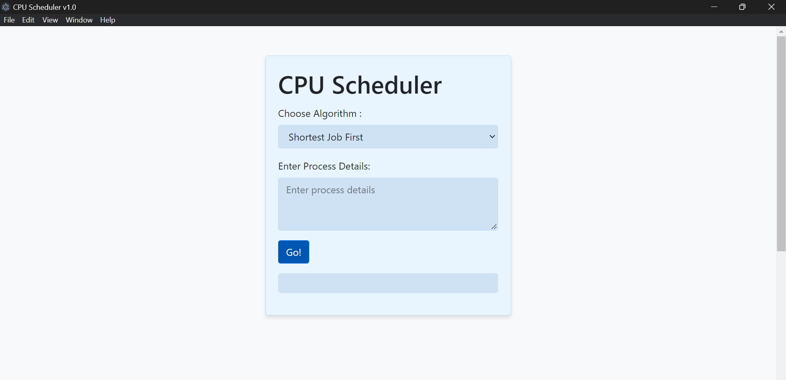
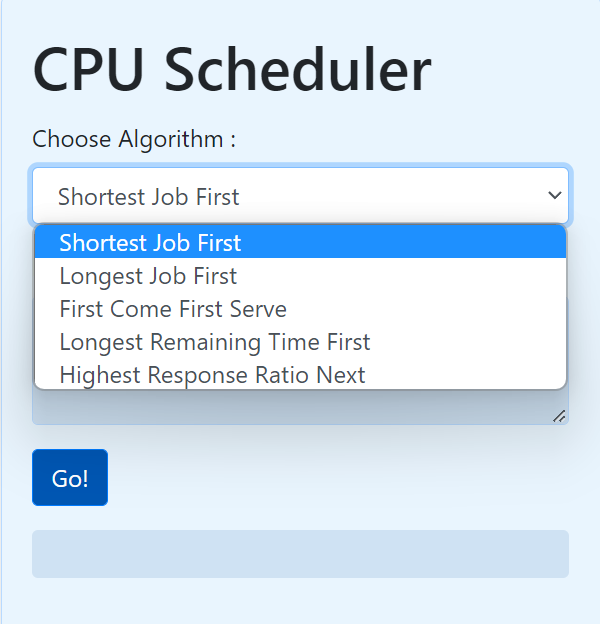
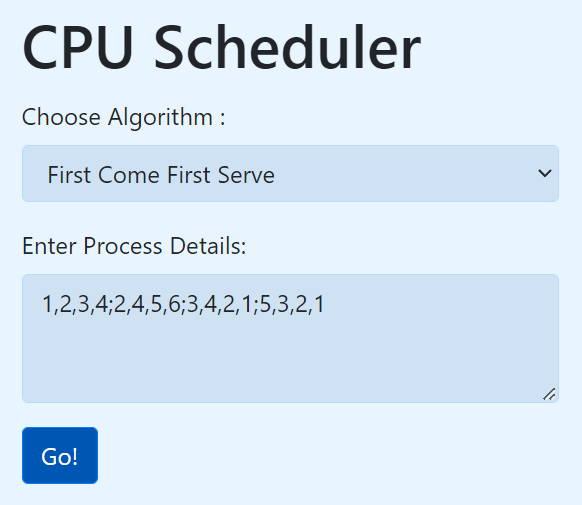
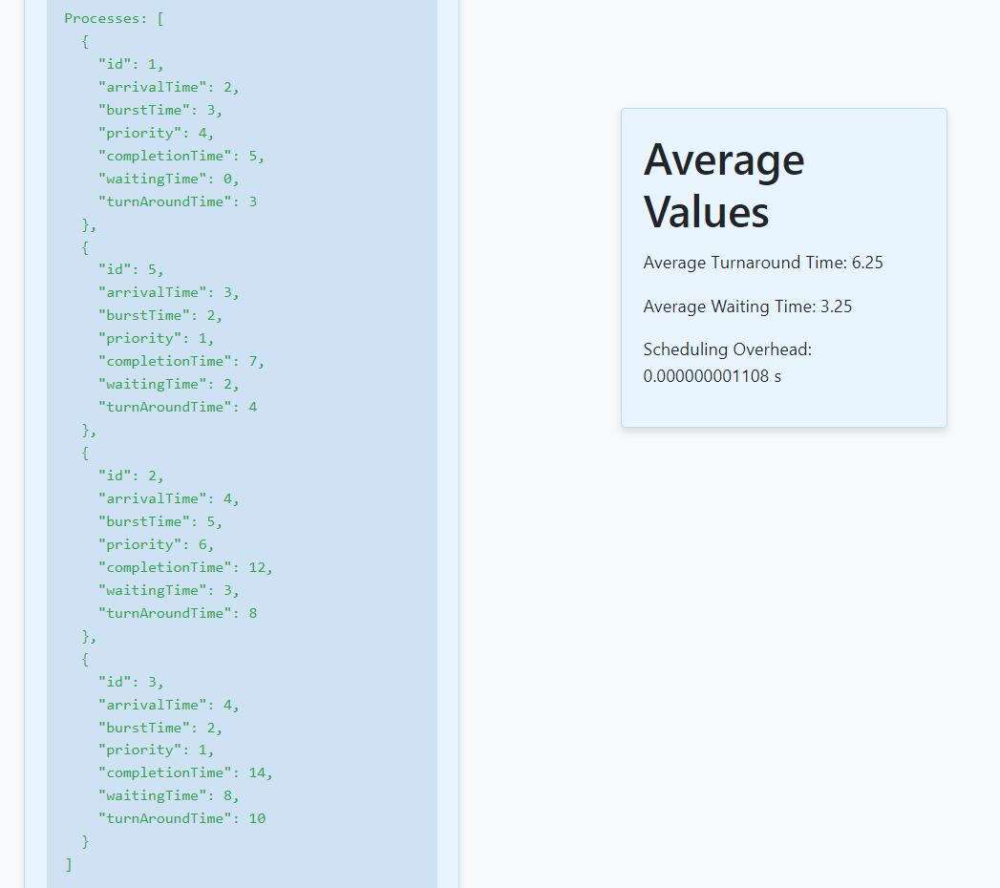
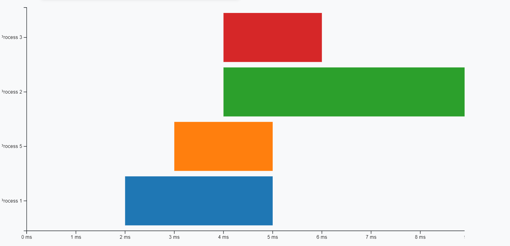
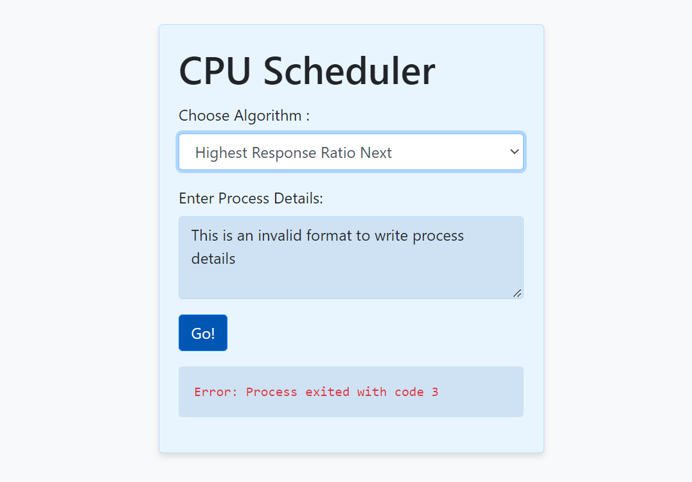

# CPU Scheduler
**Author** : Siddhant Rohila
## Project Description

Operating systems are integral to the efficient management of computer resources, with process scheduling being a core component. This project, the CPU Scheduler application, aims to simulate and evaluate various process scheduling algorithms through a user-friendly interface developed using Electron and a set of robust backend algorithms implemented in C++.

- **Scheduling Algorithms**:
  - First Come First Serve (FCFS)
  - Longest Job First (LJF)
  - Shortest Job First (SJF)
  - Highest Response Ratio Next (HRRN)
  - Longest Remaining Time First (LRTF)

- **Features**:
  - Provides insights into the strengths and weaknesses of different scheduling algorithms
  - Allows users to input various processes and observe how each scheduling algorithm manages them
  - Facilitates visualization and comparison of algorithm performance
  - Enhances understanding of how different algorithms impact system efficiency and responsiveness

- **Technology Stack**:
  - **Frontend**: User-friendly interface developed using Electron
  - **Backend**: Robust algorithms implemented in C++

- **Educational Tool**:
  - Serves as a practical resource for examining multiple scheduling strategies
  - Aids in comprehending the intricacies of process scheduling in operating systems

The combination of an intuitive Electron-based interface and a high-performance C++ backend makes the CPU Scheduler both accessible and powerful. It is an invaluable resource for anyone looking to delve into the complexities of process scheduling within operating systems.

## Installation of the Project
- Git clone this repository
- Compile the file "scheduler.cpp" with a C++ compiler.
- Run npm install in the terminal
- Further run npm start, the CPU Scheduler application will start.

## How to use the application ? 
- The first look of the application will be like this :
  

    
    
<em>Figure 1: Application's inital look</em>

  

- It consists of a selection bar where we can select one of the 5 CPU Scheduling algorithms I've implemented. You can write the process details in a format I'll explain later.
  

    
    
<em>Figure 2: The Algorithm Selection</em>

  

- Any 2 processes are separated by a semicolon ';' . The 4 numbers separated by a comma ',' are  identity, Arrival Time, Burst Time and priority for the corresponding       process respectively. Consider an example where I select the FCFS algorithm, I've written the process details as shown :
  

    
    
<em>Figure 3: FCFS Example consisting of 4 processes</em>

  

- After we press the "Go!" button, the output is as shown
    

    
    
<em>Figure 4: Output</em>

  

- The Gantt Chart display on output
  

    
    
<em>Figure 4: Output</em>

  

Let us breakdown the output of the program :
- **Completion Time** : Completion time is when a process finishes execution and is no longer being processed by the CPU. It is the summation of the arrival, waiting, and burst times. Completion time is an essential metric in CPU scheduling, as it can help determine the efficiency of the scheduling algorithm.
- **Waiting Time** : Waiting time (WT) is defined as the total time that is spent by the process while staying in a ready queue before it reaches the CPU. The difference between turnaround time and burst time is called the waiting time of a process.
- **Turnaround Time** : Turnaround time is the total time taken to execute a process from the moment it enters the CPU until it completes execution, including both CPU processing time and any time spent waiting in the ready queue or waiting for I/O operations.
- **The Average Values**
    - **Average Turnaround Time** : To find the average turnaround time for a set of processes, you sum the turnaround times of all individual processes and then divide by the number of processes.
    - **Average Waiting Time** : In CPU scheduling, the average waiting time is a key performance metric. It measures the average time a process spends waiting in the ready queue before it gets executed by the CPU. The waiting time for a process can be influenced by the scheduling algorithm used.
    - **Scheduling Overhead** : Scheduling overhead refers to the additional time and resources required to manage the execution of processes by the CPU scheduler. This overhead can impact the overall performance and efficiency of the CPU scheduling.
- **The Gantt Chart** : A Gantt chart is a visual representation of the schedule of processes or tasks over time. It provides a graphical illustration of when each process starts and finishes, allowing for easy visualization of the overall CPU scheduling process.
    - Gantt charts provide a clear and intuitive way to visualize the scheduling of processes. It allows system administrators, developers, or analysts to quickly understand the sequence of process execution.
    -  By displaying when processes are running or waiting, Gantt charts help in managing CPU resources efficiently. This is particularly useful in systems where multiple processes compete for CPU time.
    -   Gantt charts enable analysts to evaluate the effectiveness of different scheduling algorithms. By comparing the actual execution sequence against theoretical models, they can assess factors like waiting times, turnaround times, and overall system responsiveness.
    -    During runtime, Gantt charts can be updated dynamically to reflect the progress of processes. This allows for real-time monitoring of the system's workload and performance.

What happens if we throw an invalid format in the format details ? It will throw an error!
  

    
    
<em>Figure 5: Error due to invalid format</em>

  

